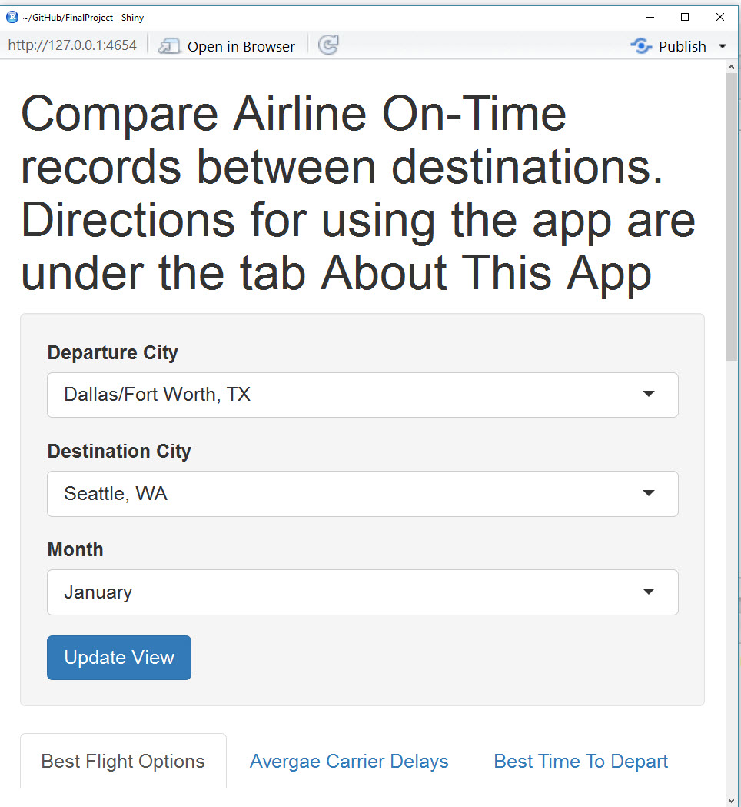
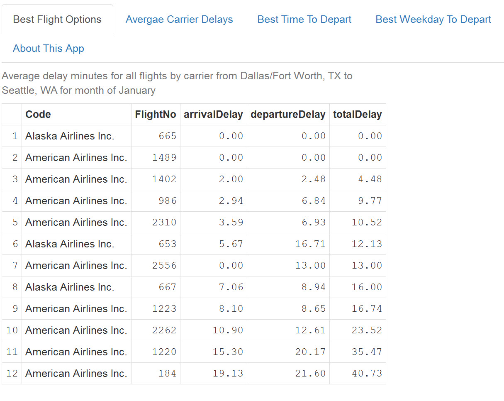
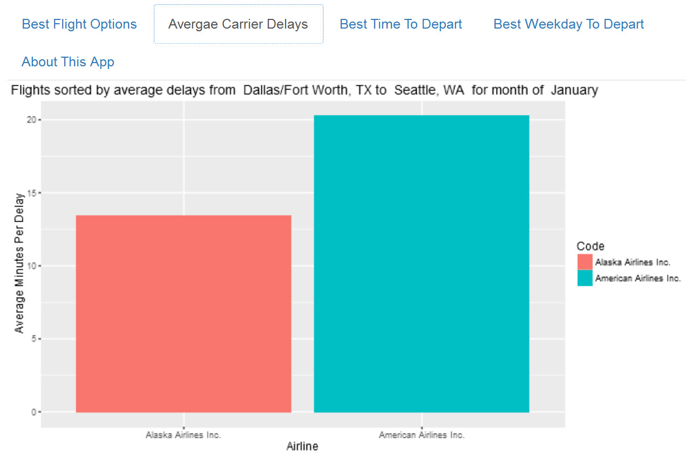
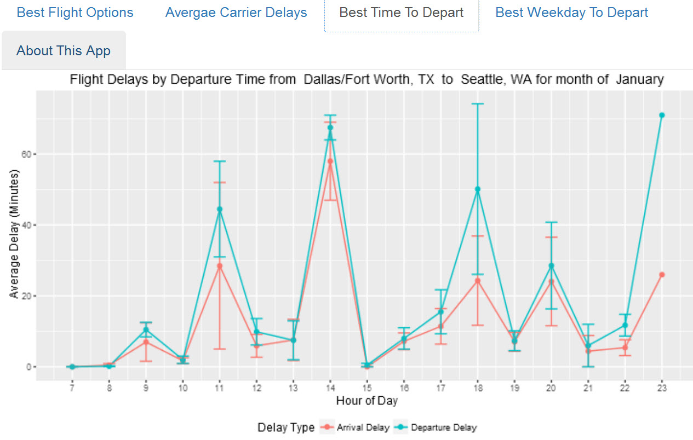
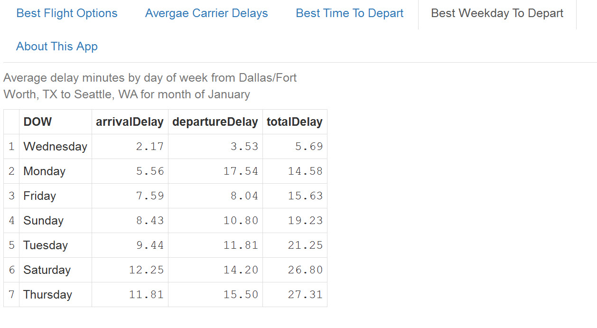

Developing Data Products
========================================================
author: Denis Edwards
date: 
autosize: true

Developing Data Products - Flight Options
========================================================
The Flight Options application provides users with delay statistics for all airlines flying between a selected pair of cities.

- The application is easy to use and driven by drop down lists to select flight origin, destination and month of travel
- Historical data is providd for the month selected allowing the user to make decisions on travel times, dates and airlines
- The application published on Shiny only contains data for January 2016 due to file size limitations. The actual application would have data from 2001 - 2016

You can access the application at https://denisedwards.shinyapps.io/FinalProject/

The data for this application is derived from the flights dataset. Here is a sample of the data. (Fulfills assignment requirement of embedding R in presentation)
========================================================

```
                    Code FlightNo DepTime
1 American Airlines Inc.       43    1057
2 American Airlines Inc.       43    1056
3 American Airlines Inc.       43    1055
4 American Airlines Inc.       43    1102
5 American Airlines Inc.       43    1240
```
User Interface
========================================================
The user interface is simple and prompts users with the information needed to plan a flight. Each tab contains information useful for flight planning.
***


What carrier and flight should I choose?
========================================================
To fly between Dallas and Seattle we see that both Alasaka Airlines and American Airlines have a flight with no delay history. 


***
For all flights, American Airlines has slightly more delay minutes per delay so perhaps the Alaska Airlines flight is best. 



When should I fly?
========================================================
Choosing the flight that leaves between 8AM and 10AM historically results in fewer delay minutes.  

***
Choosing a flight on Wednesday between Dallas and Seattle is best to avoid delays, with Thursday being the worse day to fly.

